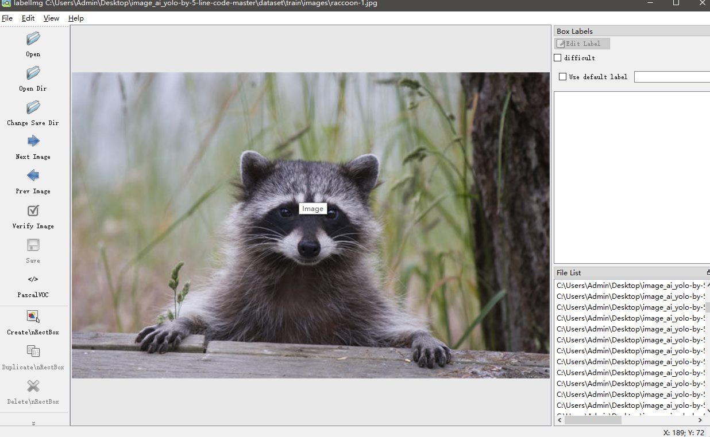
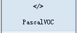
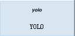
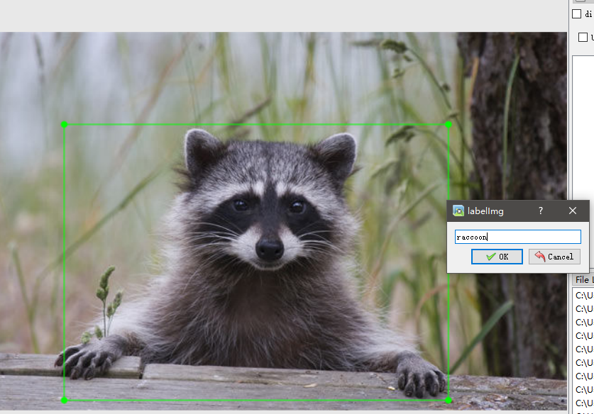
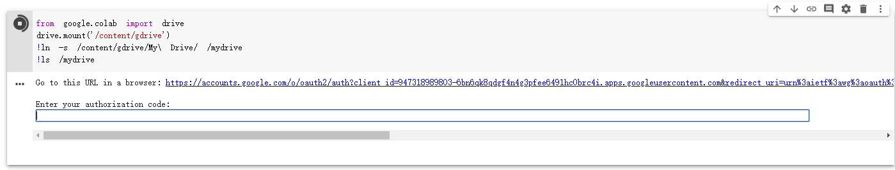
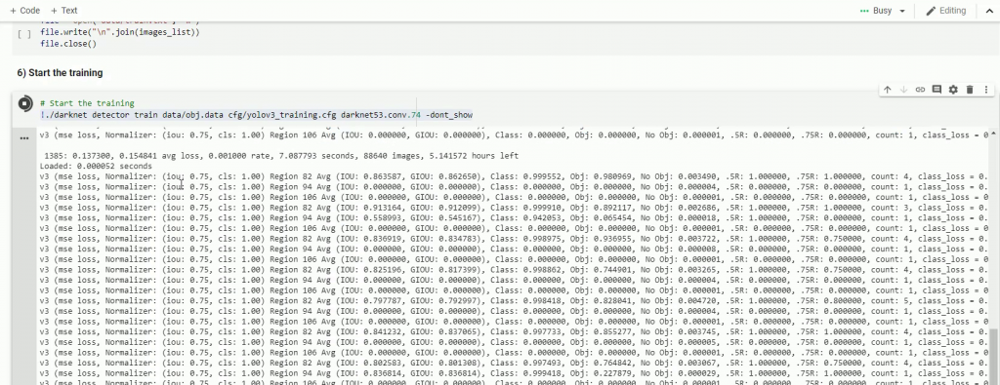
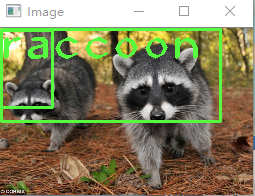

# 小白也能用google colab来在线训练yolov3目标检测模型

1. ## 用labelimg制作数据集

   1. 下载安装 

      - 去官网https://tzutalin.github.io/labelImg/ 下载地址

      - 或者pip install labelimg然后去安装python的根目录里的scripts里找到labelimg.exe文件运行

   2. 使用labelimg制作自己的数据集

      

      - 点击open Dir选择存放图片集的images文件夹，点击Change Save Dir来选择存放标签的文件夹， 这里为了简便操作，只要将标签放在图片的同一images文件夹下即可
      - 将voc切换成yolo（如果手头有做好的数据集，但是标签是xml格式的可以运行xml-txt.py脚本，修改其中的路径就可以生成yolo格式的txt文件了）
      - 然后就可以标记图片了，点击Create RectBox（或者按快捷键W）然后框出狸猫（我这里是狸猫，你想要找出什么目标就框什么）
      - 写下目标的名字，点击ok（图片中出现几个就标注几个）
      - 再点击save（也可以按Crtl+S快捷键），然后点击next image（也可以按方向键的→）标注下一副图片
      - 接着将标注好的数据进行压缩，名为images.zip的文件

2. ## 进入colab上传ipynb文件进行训练

   为了训练图像数据集，我们将使用[google colab](https://www.google.com/url?sa=t&rct=j&q=&esrc=s&source=web&cd=1&cad=rja&uact=8&ved=2ahUKEwjVtorb1MfoAhXFrHEKHXb_BFwQFjAAegQIBxAC&url=https%3A%2F%2Fcolab.research.google.com%2F&usg=AOvVaw3A5aPK2kLFzKOzb6sOckVw)提供的免费服务器。

   （当然为了去这个网站你需要科学上网，如果没有办法连上这个网站，可以加我QQ：865081643来咨询）

   它是免费的，唯一的缺点是您可以连续使用12个小时，之后将断开连接并删除文件。
   您可以重新启动它，但是从头开始做所有事情。

   我们可以通过将google colab与google drive连接来解决此问题，因此在断开连接的情况下我们不会丢失文件。

   ### 设置google drive：

   1. 转到[google drive](https://www.google.com/drive/)并登录。如果您没有帐户，请创建一个帐户并登录。
   2. 创建一个名为“ yolov3”的新文件夹。
   3. 然后将您之前创建的文件“ images.zip”上传到yolov3文件夹中。

   ### 设置google colab：

   1. 进入[google colab](https://colab.research.google.com/)并使用您用于登录[Google Drive](https://colab.research.google.com/)的相同帐户登录。

   2. 上传文件“ Train_YoloV3.ipynb” 

   3. 然后，我们需要启用GPU。因此，单击菜单栏中的编辑（edit），选择笔记本设置（notebook setting），然后选择GPU再点击保存。

   4. 

      运行第二句时出现这种情况就点击链接，出现google drive的访问权限选择允许，然后复制出现代码，将代码粘贴到对话框中，然后按回车

   5. 此后的命令可以全部运行，可以点击菜单栏中的runtime中的run all。

      看到这样的输出说明正在训练了。大概训练三四个小时可以初见端倪。中间出现报错有可能是路径错误，可以自己排查一下。

3. ## 测试训练好的模型效果

   - 每进行100次训练就会生成一次“ yolov3_training_last.weights”权重文件，而每进行1000次训练就会生成一个权重文件，例如“ yolov3_training__1000.weights”，“ yolov3_training_2000.weights”。这些权重文件需要去google云盘https://drive.google.com/下载。

   - 想要测试训练的效果如何，就将权重文件放在我的python项目的同一目录里，使用opencv来测试模型。

   - “ yolo_object_detection.py”的代码第11行上，将class名称更改“ raccoon”。

   - 修改第14行的图片路径，以便可以对其进行测试。

   - 最后的效果

     我训练的次数还不够，所以拟合效果还不是很好，但对于小白来说是一个很简单也很方便的训练方式

   

